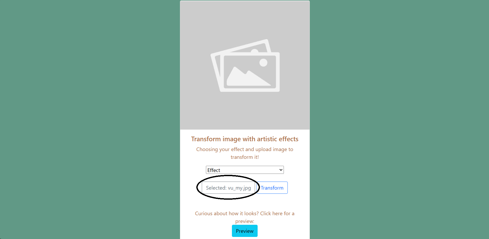
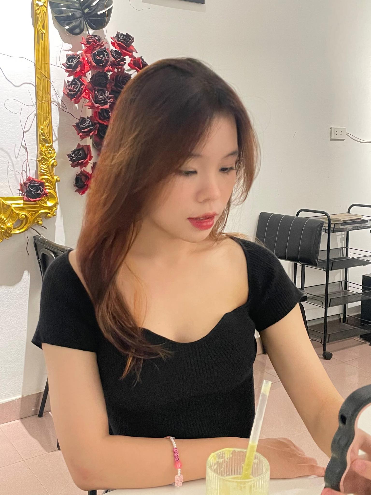

# CS50’s Introduction to Computer Science
# Transform the image with the artistic effects website!

## Video Demo:  https://www.youtube.com/watch?v=_ry8fAH29TA

## Description:
    This website allows you to transform your photos into stunning works of art by applying a variety of artistic effects.
   
    This website unlocks your inner artist, transforming ordinary photos into extraordinary creations. With its diverse range of artistic effects, you can unleash your creativity, breathing new life into your cherished memories and turning them into captivating pieces of art. From the delicate brushstrokes of a watercolor painting to the bold vibrancy of pop art, the possibilities are endless. So take your photos and embark on a journey of artistic exploration, where you'll be amazed by the beauty you can unveil with just a few clicks.

## Feture
    1. The main page for choosing effects and images.
    2. The preview page shows instruction.
    3. The result page shows the transformed image and allows you to name and save the file.

## Files & Directories
 - app.py
 - help.py
 - README.md
 - requiremnets.txt
 - uploads folder
 - templates folder
 - static folder
 - exmaple.png
 - transformed_image.png
 - images folder

### app.py
    In app.py, I used flask to run the website. Let's take a look at some functions in app.py
##### apply_effect function 
    The apply_effect function take 2 arguments - image_path for the image that the user input, effect for apply effect.
##### index function
    In index function, if the method is get, the function will return main page in index.html. If the method is post, the apply_effect function will be called and the function will return upload page in upload.html with a variable is image.
##### preview function
    This function will return preview page in preview.html. 
### help.py
    In help.py, I program some functions to transform the image and import them to app.py.
##### Effect function
    All effect function will return effect of image, includes:
    - reflection
    - grayscale
    - sepia
    - deep_blur
    - paler_blur
    - deep_pencil_sketch
    - paler_pencil_sketch
    - delete_back
    - negative
    - vintage
    - fresh
    - edges
    - bland
### requirements.txt
    In requirements.txt, I listed all pip libraries in app.py and help.py:
    - Flask
    - numpy
    - opencv-python
    - rembg
### static folder
    In static folder, I put all images I need in templates folder and program style.css for support html file.
    Style.css includes:
    - .heading
    - .for_img
    - h1.intro
    - div.preview
    - h2.head
    - p.write
    - h3.head
    - h4.head
    - .for_effect

### images folder
    All image import to this README.md.

### uploads folder
    All image saved when you click "Transform" button in the main page.   

### templates folder
    Templates folder includes layout.html, index.html, preview.html, upload.html.
    - The layout.html sets the layout for index.html, preview.html. and upload.html.
    - The index.html is the main page:

    - The preview.html is the instruction page:

    - The upload.html is the resul page:

## Implementation
    - When run flask in termianl window, a link will be showed. Click that link, the main page will appear.

### Main page
    - In main page, you will see option to choose effect, "Choose image" button, "Trasnform" button, and "Preview" button.

    - If you don't select effect and just choose image and click "Transform", the result page will appear and return your original image.
    - If you don't choose image and click "Transform", you will redirect mainpage until you choose an image.
    - Let's choose one image and select an effect and see what will happen.
    - First, choose your image:

    - As you can see, the file name you choose showed:

    - Next, select one effect you love

    - Last, click "Transform" and see what happen.

### Result page
    - After you click "Transform" in main page, result page will appear with the effect image:

    - In file name box, if you set the name, the image will save as the name you set. If you don't set the name, the default name is "transformed_image":

    - If you want to save the image, you just click "Save Transformed Image" button to save it:

    - If you don't like the effect you choose or you want to try some effects, you just click "Main page" button to rediret main page:

### Preview page
    - Let's take a look at "Preview" button in main page:

    - When you click it, preview page will appear. It will show you the instruction and some effects:

    - After you read all informations, below the page is a button to redirect main page:

### Effect
    - Now, let's see the special of this project - effect.

#### Reflection
    - Original:

    - Reflection:

#### Grayscale
    - Original:

    - Grayscale:

#### Sepia
    - Original:

    - Sepia:

#### Deep blur
    - Original:

    - Deep blur:

#### Paler blur
    - Original:

    - Paler blur:

#### Deep pencil sketch
    - Original:

    - Deep pencil sketch:

#### Paler pencil sketch
    - Original:

    - Paler pencil sketch:

#### Delete background
    - Original:

    - Delete background:

#### Negative
    - Original:

    - Negative:

#### Vintage
    - Original:

    - Vintage:

#### Fresh
    - Original:

    - Fresh:

#### Edges
    - Original:

    - Edges:

#### Bland
    - Original:

    - Bland:

## Conclusion
    Thank you for using my website! I hope these effects bring you joy and help you create beautiful and unique images. Have fun!

## Thanks
    The CS50X course provided me with exceptional knowledge about computers and their workings. It helped me progress from a complete beginner to a skilled programmer. Thanks to the dedication of Mr. David Malan, Mr. Brian, Mr. Doug Lloyd, and all the CS50X mentors, I'm now able to create projects I never thought possible before. I am deeply grateful for your support!